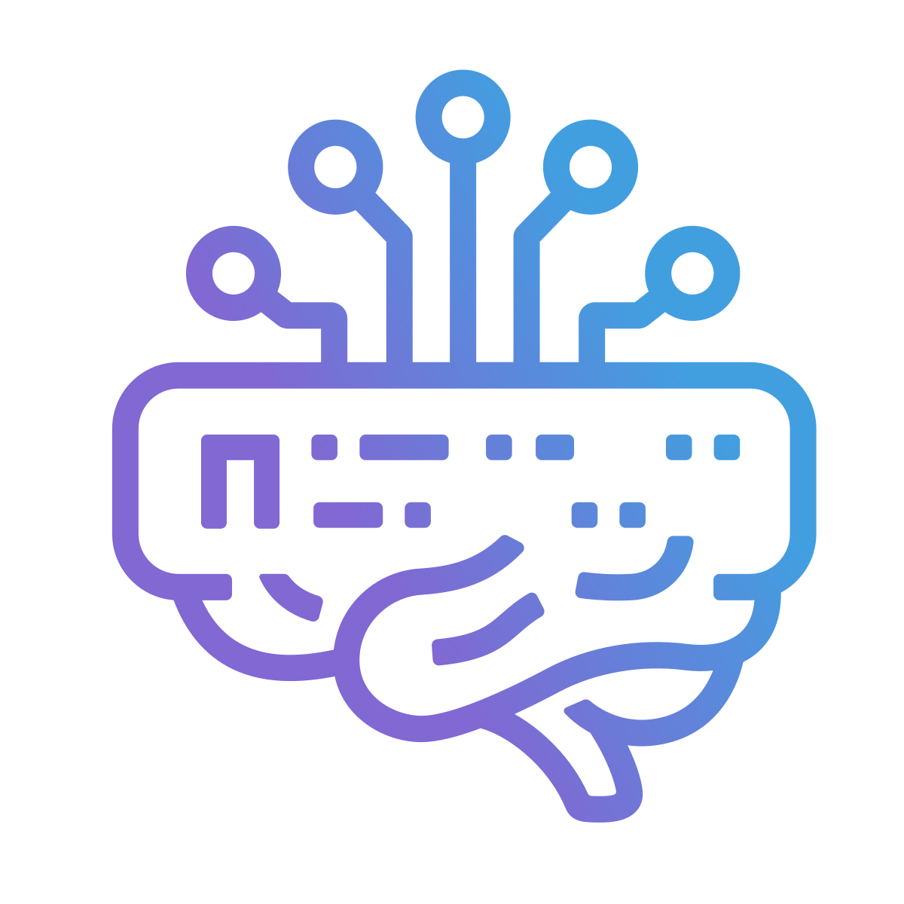

<p align="center">
  
</p>

# AgentMux

**Watch Your Agents. Stay in Control.**

A rich monitoring and orchestration UI for AI agents. See every tool call, catch regressions mid-task, and tune your agent system in real time.

[](https://opensource.org/licenses/Apache-2.0)
[](https://agentmux.ai)

## The Problem

Knowledge workers running AI agents across long-horizon tasks are blind while it happens. You can't see which agent found something important. You can't see which one went off-track. You can't redirect mid-task. You find out when it's done, or when something is wrong.

- **Agents regress.** An agent fixes a bug and then undoes its own work in a later step. By the time you notice, the context is cold and the decision chain is opaque.
- **Guardrails are tuned blind.** No live signal on which constraints are firing, which are too tight, which agents are working around.
- **Multi-agent conflicts are invisible.** Two agents reach conflicting conclusions. The synthesis picks one. You never know the conflict happened.

## What AgentMux Does

AgentMux is an open-source desktop application that surfaces what agents are doing in real time: tool calls, reasoning steps, source citations, output streams, and conflicts between agents. The human role is observer and supervisor, not driver.

Cross-platform (Windows, macOS, Linux). 100% Rust backend (Tokio + Axum). CEF host (bundled Chromium). Apache 2.0.

- **Live agent monitoring** — Watch every tool call and decision step as it happens. Catch an agent undoing correct work mid-task and redirect it before the damage compounds.
- **Multi-agent orchestration** — Run parallel agents and see all of them at once. Spot conflicts before synthesis. Redirect any agent without killing the others.
- **Guardrail observability** — See which constraints are active and firing. Tune your agent system from live signal, not post-mortem guesswork.
- **Multi-provider agent support** — Claude Code, Codex CLI, and Gemini CLI as first-class providers, alongside terminals, editor, browser, and system metrics.
- **Forge widget** — Agent picker wired to live Forge data for orchestration workflows.
- **App API** — Local WebSocket RPC so external tools and agents can open panes, send messages, and read output. See [`docs/api/getting-started.md`](./docs/api/getting-started.md).
- **Drag and drop** — Rearrange panes by dragging headers, reorder tabs, drag panes and tabs across windows.
- **Per-pane zoom** — Independent zoom level per pane, plus global chrome zoom.
- **Real PTY support** — Authentic terminal emulation via xterm.js and portable-pty.
- **Run multiple versions side-by-side** — Each instance is fully isolated (separate CEF data, separate backend sidecar, separate ports). Test a new build while the old one is still running.

## Quick Start

### Prerequisites

| Tool | Version | Purpose |
|------|---------|---------|
| **Node.js** | 22 LTS | Frontend build |
| **Rust** | 1.77+ | Backend + CEF host |
| **[Task](https://taskfile.dev/)** | Latest | Build orchestration |
| **CMake** | 3.20+ | CEF native build (cef-dll-sys) |
| **Ninja** | 1.10+ | CEF native build (cef-dll-sys) |

Platform-specific:
- **Windows:** Visual Studio Build Tools (CMake + Ninja ship with VS, but Ninja must be on PATH — see CLAUDE.md)
- **macOS:** Xcode Command Line Tools, `brew install cmake ninja`
- **Linux:** Build essentials, `apt install cmake ninja-build`

### Development

```bash
npm install        # install frontend dependencies
task dev           # CEF host + Vite hot reload
```

### Production Build

```bash
task package           # Portable ZIP for the host platform
task package:macos     # macOS DMG
task package:linux     # Linux AppImage / deb
task package:msix      # Windows MSIX installer
```

## Widgets

Available from the top bar (right side) or the window header right-click menu:

| Widget | Icon | Description |
|--------|------|-------------|
| **Agent** | sparkles | AI agent with streaming output and tool execution |
| **Forge** | hammer | Create and manage your agents |
| **Swarm** | bee | Multi-agent orchestration |
| **Terminal** | square-terminal | Terminal with xterm.js and real PTY |
| **Sysinfo** | chart-line | Live system metrics (CPU, memory, network, disk) |
| **Settings** | cog | Open settings in external editor |
| **Help** | circle-question | Built-in documentation and help |
| **DevTools** | code | Toggle WebView developer tools |

## Agents

Each agent has two names:

| Field | Purpose | Changeable? |
|-------|---------|-------------|
| **Display name** | Shown in the picker, pane title, notifications | ✅ Yes — rename any time |
| **Slug** | Drives `~/.agentmux/agents/<slug>/`, `GH_CONFIG_DIR`, `AGENTMUX_AGENT_ID` | ❌ No — set once at creation |

### How to rename an agent

1. Open the **Forge** widget (or hover an agent card in the Agent picker).
2. Click the ✏ pencil icon next to the agent's name.
3. Type the new display name and press **Enter** (or click ✓). Press **Esc** to cancel.
4. The picker card and any open pane titles update immediately.

Nothing on disk moves — working directories, GitHub CLI config dirs, and env vars all key off the immutable slug, so renaming is always safe.

### Agent identity (accounts)

Click the 👤 button on any agent card to assign external accounts (GitHub PAT, AWS profile, Anthropic API key, etc.) to that agent. Accounts are stored per-agent and survive renames. You can swap, add, or unassign accounts at any time without restarting the agent.

## App API

AgentMux exposes a local WebSocket RPC surface so external tools and agents can drive the host — open agent panes, send messages, read output, and more. It binds to loopback only and is auth-gated per instance.

```javascript
// ws://127.0.0.1:{WS_PORT}/ws?authkey={AUTH_KEY}
ws.send(JSON.stringify({
  wscommand: "rpc",
  message: { command: "agent.list", reqid: "demo-1", data: {} },
}));
```

- **Getting started:** [`docs/api/getting-started.md`](./docs/api/getting-started.md) — connect, discover credentials, make your first call.
- **Command reference:** [`docs/specs/app-api-extension.md`](./docs/specs/app-api-extension.md).
- **Implementation status:** [`docs/specs/app-api-status.md`](./docs/specs/app-api-status.md).

## Architecture

```
                    ┌─────────────────────────────────┐
                    │           Frontend               │
                    │   SolidJS + xterm.js             │
                    └──────────────────┬───────────────┘
                                       │
                    ┌──────────────────▼───────────────┐
                    │           CEF Host                │
                    │   Bundled Chromium 146 (cef-rs)   │
                    │   IPC bridge + window management  │
                    └──────────────────┬───────────────┘
                                       │
                    ┌──────────────────▼───────────────┐
                    │       Backend Sidecar             │
                    │   agentmux-srv (Rust)           │
                    │   Tokio + Axum + SQLite           │
                    │   terminals, WebSocket, RPC       │
                    └──────────────────────────────────┘
```

**Stack:**
- **Frontend:** SolidJS + TypeScript + Vite (state via SolidJS signals)
- **Desktop:** CEF 146 via cef-rs — bundles its own Chromium (~148 MB ZIP, ~150 ms startup)
- **Backend:** Rust (Tokio + Axum + SQLite + portable-pty)
- **Terminal:** xterm.js

## Build Commands

| Command | Description |
|---------|-------------|
| `task dev` | Development mode (CEF host + Vite hot reload) |
| `task build:host` | Build the CEF host binary |
| `task bundle` | Bundle CEF runtime DLLs |
| `task package` | Package a portable build for the host platform |
| `task build:backend` | Build agentmux-srv |
| `task build:frontend` | Build frontend only |
| `task test` | Run tests (vitest) |
| `task clean` | Clean build artifacts |

### Build Outputs

| Platform | Artifact |
|----------|----------|
| **Windows** | `dist/agentmux-cef-*-x64-portable.zip` |

## Version Management

Always use [`@a5af/bump-cli`](https://github.com/a5af/bump-cli) — never edit version numbers manually.

```bash
bump patch -m "Description" --commit   # bump, stage, and commit all version files
bump verify                            # check all files are consistent
bump show                              # display current version state
```

Config lives in `.bump.json`. See [BUILD.md](./BUILD.md) for the full workflow.

## Releases

Releases are built by [`agentmuxai/agentmux-builder`](https://github.com/agentmuxai/agentmux-builder) — a private repo that holds CI/CD workflows and signing secrets separate from the public source.

### How it works

1. The builder's workflow checks out this repo at the given ref
2. Builds run in parallel on `ubuntu-latest`, `macos-latest`, and `windows-latest`
3. Each job builds the Rust backend binary (agentmux-srv), then builds the CEF host
4. macOS builds are code-signed and notarized via Apple Developer credentials
5. Windows builds include both an NSIS installer and a portable ZIP
6. A final `create-release` job collects all artifacts and creates a GitHub Release on this repo

### Triggering a release

```bash
# Manual workflow dispatch (pass a tag, branch, or SHA)
gh workflow run tauri-build.yml -R agentmuxai/agentmux-builder -f ref=v0.33.0
```

### Release artifacts

| Platform | Artifact |
|----------|----------|
| macOS Apple Silicon | `AgentMux_*_aarch64.dmg` |
| Windows x64 (installer) | `AgentMux_*_x64-setup.exe` |
| Windows x64 (portable) | `agentmux-*-x64-portable.zip` |
| Linux x64 (AppImage) | `AgentMux_*_amd64.AppImage` |
| Linux x64 (deb) | `AgentMux_*_amd64.deb` |

### Full release checklist

```bash
# 1. Bump version and commit
bump patch -m "Description" --commit
bump verify

# 2. Push and tag
git push origin main
git tag v0.X.Y && git push origin v0.X.Y

# 3. Trigger the builder (builds all platforms, creates GitHub Release)
gh workflow run tauri-build.yml -R agentmuxai/agentmux-builder -f ref=v0.X.Y

# 4. Wait for build to complete (~15-20 min)
gh run list -R agentmuxai/agentmux-builder --limit 1

# 5. Deploy landing site (fetches new release, updates download links)
cd /workspace/agentmux-landing
deploy run --env prod

# 6. Verify
gh release view v0.X.Y --repo agentmuxai/agentmux    # release exists with assets
curl -sf https://agentmux.ai/release.json | jq .version  # landing shows new version
```

## License

Developed by **[AgentMux Corp.](https://agentmux.ai)** — Delaware corporation.

Apache-2.0 — Originally forked from [Wave Terminal](https://github.com/wavetermdev/waveterm)
