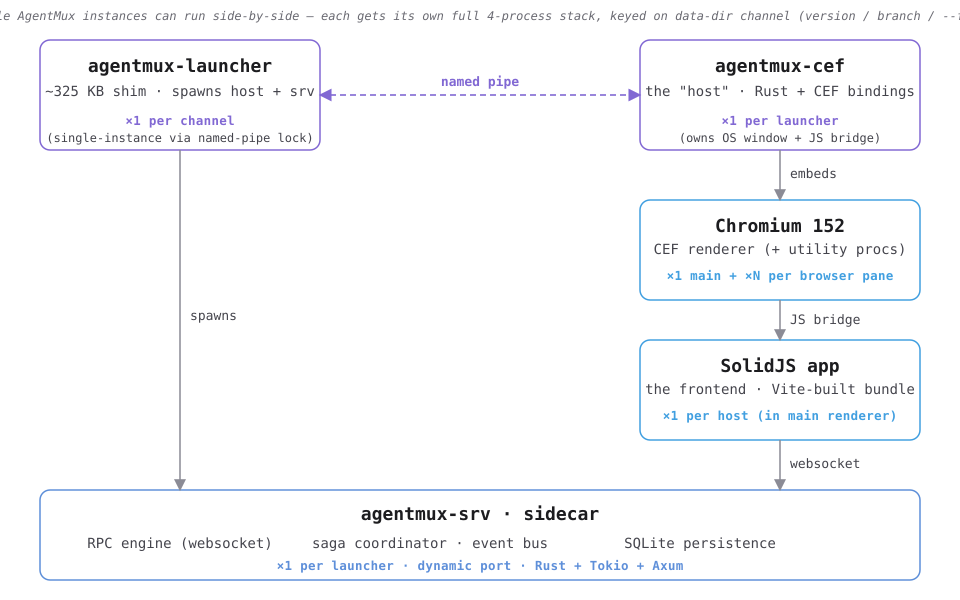

<!-- The early-alpha warning is the first content block by design — see
docs/specs/SPEC_EARLY_ALPHA_WARNING_2026_06_05.md. Decorative logo/title
follow below so the warning is never pushed below the fold. -->

> ## ⚠️ EARLY ALPHA — Use At Your Own Risk
>
> **AgentMux is in early alpha.** Many features are incomplete, partially
> broken, or change between releases without notice. Expect:
>
> - **Broken features** — pieces of the UI may not function, or may regress
>   from one release to the next.
> - **Data loss** — settings, pane layouts, and agent state may not migrate
>   cleanly across versions. Don't store anything you can't reproduce.
> - **Breaking changes** — config files, identity bundles, memory bundles,
>   and the App API may change shape with no migration path during alpha.
> - **Platform gaps** — Windows is the primary target; macOS and Linux
>   builds lag behind and have additional known issues.
>
> If you hit a problem, **please report it as a GitHub issue** at
> https://github.com/agentmuxai/agentmux/issues — it's how alpha gets to beta.

---

<p align="center">
  
</p>

# AgentMux

**The agent operating environment**

Run any agent as a first-class pane — Claude Code, Codex, Gemini, Copilot, and more — each with its own identity, native memory, and a structured view of tool calls and diffs. Agents can drive the workspace itself through a local API. Multi-provider, local-first, 100% Rust. Free and open source.

[](https://opensource.org/licenses/Apache-2.0)
[](https://agentmux.ai)

## The Problem

Today's agents run inside terminal wrappers — raw stdout, no real identity, no shared context, and no way to talk to each other. You re-onboard a stranger every session, you can't see what an agent is actually doing mid-task, and long-lived provider CLIs sit there hogging memory the whole time.

- **Agents are afterthoughts.** A terminal wrapper hands you raw output, not a structured view of tool calls, reasoning steps, and file diffs.
- **Every provider is a silo.** Claude, Codex, and Gemini each run in isolation — no shared workspace, no interop, no way for one agent to hand off to another.
- **You're the integration layer.** Copy-pasting between windows, re-explaining the same context, babysitting heavyweight CLI processes.

## What AgentMux Does

AgentMux is an open-source agent operating environment. Run any agent as a first-class pane — with its own identity, native memory, and a structured view of tool calls and file diffs — and let agents drive the workspace itself through a local API. AgentMux owns the session state, so most provider CLIs run one-shot per turn instead of as long-lived, memory-hogging processes, and a light Rust core holds many agents at once.

Cross-platform (Windows, macOS, Linux). 100% Rust backend (Tokio + Axum). CEF host (bundled Chromium). Apache 2.0.

- **Multi-provider agent panes** — Claude Code, Codex, Gemini, GitHub Copilot, Qwen, Kimi, OpenClaw, and Pi as first-class providers, alongside **Terminal**, **Editor**, **Browser**, and **Sysinfo** panes. Structured views of tool calls, reasoning, and diffs — not a terminal wrapper.
- **Agents drive the workspace** — Via the App API, a running agent can open panes, rename tabs, navigate the layout, and message peer agents — over a typed local WebSocket. Agents are operators, not passengers.
- **Interagent comms** — `SendMessage` routes one agent's output into another agent's input, so you can build hand-offs and reactive pipelines.
- **Swarm** — A live two-level agent/subagent tree. Watch delegation chains and every subagent's activity in one view.
- **Identity bundles** — Named credential sets (GitHub PAT, AWS profile, Anthropic key, etc.), keychain-backed, assigned per agent at launch. Survive renames; swappable without restart.
- **Bundles** — Capture an agent's instructions and context files once and reuse them across agents (renamed from "presets"). Backend: `db_bundles`; managed from the Armory tab (hamburger → Armory → Bundles).
- **Native memory** — Agents read and write their own memory files (`agent:memory:*`). Deeper cross-session memory is actively in development.
- **One-shot CLIs, AgentMux owns state** — Most provider CLIs are invoked per turn (Subprocess/ACP controllers); Claude Code runs as a persistent stream. Either way AgentMux holds the durable session state, so a 150–350MB Rust core stays flat over long sessions (no GC pauses, no heap growth).
- **Reducer stack** — A multi-layer reducer architecture (launcher / host / sidecar / frontend) with structured event logs, so "what mutated this state?" has one place to look.
- **Browser pane** — Native `CefBrowserView` embedded as a child window of the AgentMux frame — full Chromium fidelity (links, popups, DRM) without iframe limitations.
- **App API** — Local WebSocket RPC with an intent-based layer (`agent.open`, `agent.send`, `pane.open`) and a low-level command catalog (block, file, event, conn). External tools and agents can drive the host directly.
- **Drag and drop** — Rearrange panes by dragging headers, reorder tabs, tear panes off into floating windows, and dock them into any window.
- **Real PTY support** — Authentic terminal emulation via xterm.js and portable-pty.
- **Run multiple versions side-by-side** — Each instance is fully isolated (separate CEF data, separate backend sidecar, separate ports). Test a new build while the old one is still running.
- **Local-first** — Agents run on your machine. No telemetry, no phone-home; air-gap capable.

## Quick Start

### Prerequisites

| Tool | Version | Purpose |
|------|---------|---------|
| **Node.js** | 24 LTS | Frontend build |
| **Rust** | 1.77+ | Backend + CEF host |
| **[Task](https://taskfile.dev/)** | Latest | Build orchestration |
| **CMake** | 3.20+ | CEF native build (cef-dll-sys) |
| **Ninja** | 1.10+ | CEF native build (cef-dll-sys) |

Platform-specific:
- **Windows:** Visual Studio Build Tools (CMake + Ninja ship with VS, but Ninja must be on PATH — see CLAUDE.md)
- **macOS:** Xcode Command Line Tools, `brew install cmake ninja`
- **Linux:** Build essentials, `apt install cmake ninja-build build-essential libwayland-dev libxkbcommon-dev libgtk-3-dev libglib2.0-dev libpango1.0-dev libcairo2-dev libgdk-pixbuf2.0-dev libatk1.0-dev` — see [Linux guide](docs/linux.md)

### Development

```bash
npm install        # install frontend dependencies
task dev           # CEF host + Vite hot reload
```

### Production Build

```bash
task package            # Portable ZIP for the host platform
task package:linux      # Linux AppImage (writes to ~/Desktop)
```

`task package` builds a local portable with a unique build label — no version bump, no git changes. See [CLAUDE.md](./CLAUDE.md) for the full build labeling and data-isolation details.

### Logs

The `muxlog` helper (shipped in every AgentMux terminal) **discovers and renders logs across every running instance** — the shared dir, each `task dev` instance (`~/.agentmux/dev/<branch>/`), and per-build channels — so you never hunt for a file or guess a version. It defaults to the **most-recently-active** instance and renders the NDJSON logs as compact `time  level  target  message`.

| What | Command |
|------|---------|
| List every instance's logs (newest first) | `muxlog ls` |
| Tail the active host log (follow) | `muxlog host` |
| Tail the active sidecar log | `muxlog srv` |
| Frontend `[fe]` lines only | `muxlog fe` |
| Launcher log | `muxlog launcher` |
| Search the sidecar (agent transcript excluded) | `muxlog srv grep <regex>` |
| Errors + warnings across host & sidecar | `muxlog errors` |
| Startup-handshake trace (debug reconnect loops) | `muxlog bridge` |
| Target a specific instance | `muxlog host -i <branch\|version>` |
| Full usage | `muxlog help` |

Works identically across `task dev`, portable, and installed builds. Full reference (targets, filters, recipes, how discovery works): **[docs/MUXLOG.md](docs/MUXLOG.md)**. Per-process log layout and the underlying data dirs: [docs.agentmux.ai/internals/data-layout](https://docs.agentmux.ai/internals/data-layout/) and [/internals/debugging](https://docs.agentmux.ai/internals/debugging/).

## Widgets

Every widget is pinned by default — the widget bar shows the full set directly, collapsing to icon-only when the title bar is narrow. The canonical list is `agentmux-srv/src/config/widgets.json`.

| Widget | Icon | View | Description |
|--------|------|------|-------------|
| **Agent** | sparkles | `agent` | AI agent with streaming output and tool execution |
| **Browser** | globe | `browser` | Embedded native `CefBrowserView` |
| **Terminal** | square-terminal | `term` | Terminal with xterm.js and real PTY |
| **Sysinfo** | chart-line | `sysinfo` | Live system metrics (CPU, memory, network, disk) |
| **Editor** | file-code | `editor` | Code editor with syntax highlighting |
| **Swarm** | bee | `swarm` | Multi-agent orchestration overview |
| **Drone** | diagram-project | `drone` | Visual DAG-of-blocks drone engine |
| **Help** | circle-question | `help` | Built-in documentation and help |
| **Warden** | shield-halved | `warden` | Monitor and control agents across Host / LAN / Internet layers |

### Not widgets — opened from elsewhere

| Surface | How to reach it |
|---|---|
| **Agent setup** | Vault icon in an Agent pane's header → Accounts / Memories / MCP Servers / Skills / Startup tabs. Accounts assigns the credential bundle for this instance; Memories browses native memory; MCP Servers and Skills bind agent-private or global entries; Startup selects an Armory Bundle as Session Context's startup instructions. Replaces the old Forge concept. |
| **Settings** | Hamburger menu (≡) in the top tab bar → Settings. Opens the Settings pane (Appearance, Window & Panes, Terminal, Sounds, Network, Advanced); a footer button opens the raw `settings.json` in your default editor as an escape hatch. |
| **DevTools** | Hamburger menu (≡) in the top tab bar → DevTools. Toggles Chromium DevTools (no longer a widget). |

## Agents

Each agent has two names:

| Field | Purpose | Changeable? |
|-------|---------|-------------|
| **Display name** | Shown in the picker, pane title, notifications | ✅ Yes — rename any time |
| **Slug** | Drives `~/.agentmux/agents/<slug>/`, `GH_CONFIG_DIR`, `AGENTMUX_AGENT_ID` | ❌ No — set once at creation |

### How to rename an agent

1. Hover an agent card in the Agent picker.
2. Click the ✏ pencil icon next to the agent's name.
3. Type the new display name and press **Enter** (or click ✓). Press **Esc** to cancel.
4. The picker card and any open pane titles update immediately.

Nothing on disk moves — working directories, GitHub CLI config dirs, and env vars all key off the immutable slug, so renaming is always safe.

### Agent identity (accounts)

Click the 👤 button on any agent card to assign external accounts (GitHub PAT, AWS profile, Anthropic API key, etc.) to that agent. Accounts are stored per-agent and survive renames. You can swap, add, or unassign accounts at any time without restarting the agent.

## App API

AgentMux exposes a local WebSocket RPC surface so external tools and agents can drive the host — open agent panes, send messages, read output, and more. It binds to loopback only and is auth-gated per instance.

```javascript
// ws://127.0.0.1:{WS_PORT}/ws?authkey={AUTH_KEY}
ws.send(JSON.stringify({
  wscommand: "rpc",
  message: { command: "agent.list", reqid: "demo-1", data: {} },
}));
```

- **Getting started:** [`docs/api/getting-started.md`](./docs/api/getting-started.md) — connect, discover credentials, make your first call.
- **Command reference:** [`docs/specs/app-api-extension.md`](./docs/specs/app-api-extension.md).
- **Implementation status:** [`docs/specs/app-api-status.md`](./docs/specs/app-api-status.md).

## Architecture

AgentMux is a four-process desktop app. Each process owns one concern, end-to-end. See [Architecture overview](https://docs.agentmux.ai/architecture-overview/) for the full topology.

<p align="center">
  
</p>

| Process | Crate | Role |
|---|---|---|
| **launcher** | `agentmux-launcher` | Sets DLL search path; spawns the host; tracks Window Reality Reconciliation; durable event log for OS-level facts. |
| **host** | `agentmux-cef` | Embeds Chromium via CEF; owns the OS window, the browser panes, the JS bridge, and IPC fan-out to the renderer. |
| **sidecar** | `agentmux-srv` | App domain: workspaces, tabs, blocks, layouts, agents, identity. Persists to SQLite. Auto-spawned by the host on a dynamic port. |
| **renderer** | `frontend/` | SolidJS UI running inside CEF. Stateless — projects what the sidecar/host expose, dispatches user actions back through them. |

A fifth crate, `agentmux-common`, provides shared utilities (path resolution, runtime mode detection) consumed by all the above.

**Stack:**
- **Frontend:** SolidJS + TypeScript + Vite (state via SolidJS signals + a 4-layer reducer stack)
- **Desktop:** CEF 148 via cef-rs — bundles its own Chromium (~160 MB ZIP package, ~150 ms startup, 150–350 MB resident)
- **Backend:** Rust (Tokio + Axum + SQLite + portable-pty)
- **Terminal:** xterm.js

## Build Commands

| Command | Description |
|---------|-------------|
| `task dev` | Development mode (CEF host + Vite hot reload) |
| `task build:host` | Build the CEF host binary |
| `task bundle` | Bundle CEF runtime DLLs |
| `task package` | Package a portable build for the host platform |
| `task build:backend` | Build agentmux-srv |
| `task build:frontend` | Build frontend only |
| `task test` | Run tests (vitest) |
| `task clean` | Clean build artifacts |

### Build Outputs

Local build outputs from `task package` on the host platform:

| Platform | Task | Artifact |
|----------|------|----------|
| **Windows** | `task package` | `~/Desktop/agentmux-<version>+g<sha>[.dirty].<stamp>-x64-portable/` and `.zip` |
| **Linux** | `task package:linux` | `~/Desktop/AgentMux_*_amd64.AppImage` |

Release artifacts (macOS DMG, Windows installer, Linux AppImage) are built by CI workflows in this repo. See [§Releases](#releases).

## Version Management (Changesets)

**Feature PRs add a changeset, not a version bump.** RFC #857 Phase 2.

```bash
task changeset -- patch "fix(scope): short description"
# Allowed bump types: patch | minor | major
```

This creates a uniquely-named `.changesets/<id>.md` you commit with your code. Parallel-agent PRs never conflict on version files because they each have their own changeset filename.

A separate **release PR** consumes pending changesets. `task release` auto-detects the bump type (`major > minor > patch`); `task release:patch` / `task release:minor` let you force a specific type. All 5 version files are staged automatically.

Release PRs must contain **only**: changeset deletions, `VERSION_HISTORY.md` entry, and version bumps (`package.json`, `Cargo.toml`, `Cargo.lock`, `package-lock.json`).

See [BUILD.md](./BUILD.md) and [.changesets/README.md](./.changesets/README.md) for the full workflow.

## Releases

### Download

**Stable release** — see [GitHub Releases](https://github.com/agentmuxai/agentmux/releases/latest) for the latest published build.

**Nightly builds** — built daily from `main`, retained for 7 days. [](https://github.com/agentmuxai/agentmux/actions/workflows/ci-nightly-artifacts.yml)

| Platform | Nightly artifact |
|----------|-----------------|
| 🍎 macOS Apple Silicon | `AgentMux_*_arm64.dmg` |
| 🐧 Linux x86_64 | `AgentMux_*_amd64.AppImage` |
| 🪟 Windows x64 (installer) | `AgentMux-*-x64-setup.exe` |
| 🪟 Windows x64 (portable) | `agentmux-*-x64-portable.zip` |
| 🪟 Windows x64 (MSIX / Store) | `AgentMux_*_x64.msix` |

> Downloads require a GitHub account. Click the badge → latest passing run → **Artifacts** at the bottom.

---

### Release artifacts

Builds run in parallel on `ubuntu-22.04`, `macos-latest`, and `windows-latest`. macOS builds are code-signed and notarized. Windows builds produce both an Inno Setup installer and a portable ZIP.

| Platform | Artifact |
|----------|----------|
| macOS Apple Silicon | `AgentMux_*_arm64.dmg` |
| Windows x64 (installer) | `AgentMux-*-x64-setup.exe` |
| Windows x64 (portable) | `agentmux-*-x64-portable.zip` |
| Windows x64 (MSIX / Store) | `AgentMux_*_x64.msix` |
| Linux x64 (AppImage) | `AgentMux_*_amd64.AppImage` |

### Release checklist

```bash
# 1. Consume changesets, bump version, update VERSION_HISTORY
task release              # auto-detect bump type from changesets
git diff --staged         # should contain ONLY changeset deletions + version bumps
git commit -m "chore: release v0.X.Y"
git push -u origin <branch>/release-v0.X.Y
# open PR, merge to main after review

# 2. Tag once merged
git checkout main && git pull
git tag v0.X.Y && git push origin v0.X.Y
```

## Contact Us

For enterprises interested in adopting or deploying AgentMux at scale, including technical consulting, sponsorship opportunities, or partnership inquiries, please contact us at [enterprise@agentmux.ai](mailto:enterprise@agentmux.ai).

## Disclaimer

AgentMux is provided "AS IS", without warranty of any kind, express or implied,
including but not limited to the warranties of merchantability, fitness for a
particular purpose, and non-infringement.

Performance figures, feature descriptions, and any claims in this README are
best-effort observations from our development environment — they are not
guarantees. See [LICENSE](./LICENSE) sections 7 (Disclaimer of Warranty) and
8 (Limitation of Liability) for the full terms.

## License

AgentMux is released under the [Apache License 2.0](./LICENSE).

- [NOTICE](./NOTICE) — required attributions per Apache License 2.0 § 4(d)
- [LEGAL.md](./LEGAL.md) — corporate entity, trademark, contact
- [ACKNOWLEDGEMENTS.md](./ACKNOWLEDGEMENTS.md) — third-party software and attributions
- [SECURITY.md](./SECURITY.md) — vulnerability disclosure policy

Originally forked from [Wave Terminal](https://github.com/wavetermdev/waveterm),
copyright Command Line Inc., licensed under the Apache License 2.0.

Copyright © 2025-2026 AgentMux Corp.
