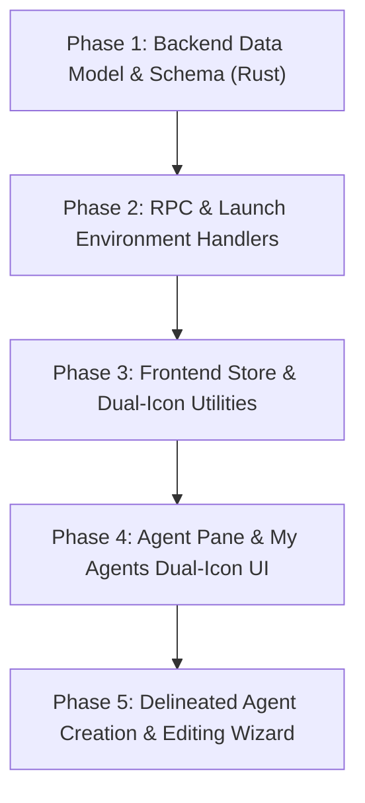

# Implementation Plan: Harness vs. Model Vendor Application Realization

**Target Version:** AgentMux v0.55+  
**Workspace:** [`C:\Systems\agentmux-agy`](file:///C:/Systems/agentmux-agy)  
**Status:** Ready for Execution  

---

## 1. Goal & Architecture Overview

Realize the full separation of **Agent Harness (CLI Execution Driver)** and **Model Vendor (Intelligence Endpoint)** throughout the AgentMux application interface and backend bindings.

### Primary UI/UX Requirements:
1. **Dual-Icon Visualization (My Agents & Cards)**:
   - Every agent row, card, and tab header renders **two distinct icons**:
     - **Primary Icon (Harness)**: Execution engine (e.g. Claude Code sparkler, AGY lightning zap, Codex robot, OpenClaw lobster, MuxCode brain).
     - **Secondary Badge Icon (Model Vendor)**: Intelligence source vendor (e.g. Anthropic, Google Gemini diamond, OpenAI, OpenRouter, Ollama, Custom Proxy).
2. **Delineated Agent Creation Wizard**:
   - Step 1: Select **Agent Harness** (Execution Engine & Tool Runtime).
   - Step 2: Select **Model Vendor & Intelligence Model** (filtered by harness compatibility).
   - Step 3: Configure **Endpoint / Base URL & Auth** (Default API, Custom Base URL/Proxy).

---

## 2. Phased Implementation Roadmap

---

### Phase 1: Backend Data Model & Schema (Rust)
**Goal:** Extend Rust structures and database bindings to explicitly represent `harness_engine` and `model_vendor`.

- **Files to Modify:**
  - [`agentmux-srv/src/backend/agent_config.rs`](file:///C:/Systems/agentmux-agy/agentmux-srv/src/backend/agent_config.rs): Add `harness_engine: Option<String>` and `model_vendor: Option<String>` to `AgentDefinition` struct.
  - [`agentmux-srv/src/backend/providers.rs`](file:///C:/Systems/agentmux-agy/agentmux-srv/src/backend/providers.rs): Extend `ProviderConfig` with `harness` & `supported_vendors` static fields.
  - [`agentmux-srv/src/migrations/m0020_agent_harness_vendor_fields.rs`](file:///C:/Systems/agentmux-agy/agentmux-srv/src/migrations/): Add database migration adding `harness_engine` and `model_vendor` columns to `db_agents` table with default fallbacks.

---

### Phase 2: RPC & Launch Environment Handlers
**Goal:** Update RPC protocols and environment variable injection for custom base URLs and model endpoints.

- **Files to Modify:**
  - [`agentmux-srv/src/server/agent_handlers/core.rs`](file:///C:/Systems/agentmux-agy/agentmux-srv/src/server/agent_handlers/core.rs): Expose `harness_engine` and `model_vendor` in `ListRecentSessionsCommand` and `AgentDefine` RPC payloads.
  - [`agentmux-srv/src/identity/resolver/inject.rs`](file:///C:/Systems/agentmux-agy/agentmux-srv/src/identity/resolver/inject.rs): Inject vendor-specific base URL overrides (`ANTHROPIC_BASE_URL`, `OPENAI_BASE_URL`, `GEMINI_CLI_HOME`, etc.) based on `model_vendor` and custom endpoint settings.

---

### Phase 3: Frontend Store & Dual-Icon Utilities
**Goal:** Create dual-icon UI components and update frontend model stores.

- **Files to Create / Modify:**
  - [`frontend/app/element/DualProviderLogo.tsx`](file:///C:/Systems/agentmux-agy/frontend/app/element/DualProviderLogo.tsx): Create new SolidJS component rendering primary Harness logo with an overlaid mini Vendor badge icon and rich tooltip ("Antigravity harness running Gemini 3.6 Flash via Google").
  - [`frontend/app/view/agent/providers/types.ts`](file:///C:/Systems/agentmux-agy/frontend/app/view/agent/providers/types.ts): Update TypeScript definitions for `AgentDefinition` and `RecentSessionRow`.
  - [`frontend/app/view/agent/agent-model.ts`](file:///C:/Systems/agentmux-agy/frontend/app/view/agent/agent-model.ts): Update agent definition resolution logic to compute harness and vendor fallback pairs.

---

### Phase 4: Agent Pane & "My Agents" Dual-Icon UI
**Goal:** Update all agent lists, cards, headers, and composer strips to display dual icons.

- **Files to Modify:**
  - [`frontend/app/view/agent/components/AgentCard.tsx`](file:///C:/Systems/agentmux-agy/frontend/app/view/agent/components/AgentCard.tsx): Replace single `<ProviderLogo>` with `<DualProviderLogo harness={...} vendor={...} />`.
  - [`frontend/app/view/agent/components/MyAgentsList.tsx`](file:///C:/Systems/agentmux-agy/frontend/app/view/agent/components/MyAgentsList.tsx): Render dual icons for every row in "My Agents".
  - [`frontend/app/view/agent/components/AgentPaneIcon.tsx`](file:///C:/Systems/agentmux-agy/frontend/app/view/agent/components/AgentPaneIcon.tsx): Update pane tab icon generator to display dual-icon badge.
  - [`frontend/app/view/agent/components/AgentControlBar.tsx`](file:///C:/Systems/agentmux-agy/frontend/app/view/agent/components/AgentControlBar.tsx): Render harness and model vendor badges in agent header strip.

---

### Phase 5: Delineated Agent Creation & Editing Wizard
**Goal:** Provide an intuitive step-by-step agent creation experience separating execution harness from intelligence model.

- **Files to Modify:**
  - [`frontend/app/view/agent/components/AgentCreateFromTemplateModal.tsx`](file:///C:/Systems/agentmux-agy/frontend/app/view/agent/components/AgentCreateFromTemplateModal.tsx): Re-architect modal layout into two distinct sections:
    1. **Harness Selector Card Grid**: Choose execution driver (Claude Code, Antigravity/AGY, Codex, OpenClaw, MuxCode).
    2. **Model & Vendor Picker**: Select model family (Gemini 3.6 Flash, Claude Sonnet 5, GPT-5.5, DeepSeek R1) with option for Custom Endpoint / Base URL input.
  - [`frontend/app/view/agent/agent-config-builder.ts`](file:///C:/Systems/agentmux-agy/frontend/app/view/agent/agent-config-builder.ts): Update builder to assemble complete `AgentDefinition` payload.

---

## 3. Verification & Testing Plan

1. **Rust Backend Unit & Integration Tests**:
   - Run `cargo test` in `agentmux-srv` verifying schema migration, RPC serialization, and environment variable injection.
2. **Frontend Component & Visual Tests**:
   - Run Vitest component tests on `DualProviderLogo`, `AgentCard`, `MyAgentsList`, and `AgentCreateFromTemplateModal`.
3. **End-to-End Execution Test**:
   - Create an agent with **AGY harness** + **Gemini 3.6 Flash** model and verify dual icons render in "My Agents" list and tab bar.
