# SPEC: Browser Pane Lifecycle & State Machine

Status: draft (analysis only — no code changes)
Date: 2026-04-17
Owner: AgentA
Bug: "Close pane → DOM gone, but Chromium content still painted; keystrokes stuck in dead pane."

## 1. The four owners of a pane

A single browser pane is co-owned by four authorities. None of them holds the truth alone, and today there is no protocol to keep them aligned.

| Owner | Identifier | Where | What it stores |
|-------|------------|-------|----------------|
| Layout tree | `nodeId` -> `TabLayoutData{blockId}` | `frontend/layout/lib/layoutModel.ts` | tree topology |
| ViewModel + React/Solid | `BlockComponentModel{blockId}` | `frontend/app/block/block.tsx:267-282` | UI state, atoms |
| Rust pane manager | `block_id -> label` | `agentmux-cef/src/browser_panes.rs:20` | label mapping |
| AppState + CEF | `label -> Browser` (CEF holds HWND) | `agentmux-cef/src/state.rs:206`, Chromium internal | HWND, render process |

`BrowserPaneManager.panes` is a **cache** of `block_id -> label`. `state.browsers` is a **cache** of `label -> Browser`. CEF/Chromium holds the **truth** (the HWND). The frontend layout tree is the **command source** but only sees blockIds.

## 2. State enumeration

States today are entirely implicit. Below is the latent enum (not present in code):

| State | Frontend (VM + React) | Rust (`panes`) | AppState (`browsers`) | CEF (HWND) | Nameable today? |
|-------|----------------------|----------------|----------------------|------------|-----------------|
| NotCreated | no VM, no view | absent | absent | none | implicit (absence) |
| CreationPending | VM exists, view mounted, `paneCreated=false` | label inserted (`browser_panes.rs:52`) | absent (browser not yet in `on_after_created`) | UI thread task queued | implicit |
| CreationInFlight | same | label present | absent | `browser_host_create_browser` running | implicit |
| CreatedIdle | `paneCreated=true` | label present | Browser present | HWND alive, blank/about | implicit |
| Loading | `loadingAtom=true` | same | same | navigation in progress | implicit |
| Loaded | `loadingAtom=false` | same | same | renderer painted | implicit |
| FocusedHwnd | same | same | same | `WM_SETFOCUS` accepted (gated by `ALLOW_PANE_FOCUS_ONCE`) | implicit |
| Defocused | same | same | same | `host.set_focus(0)` issued by `defocus_all` | implicit |
| Navigating | `loadingAtom=true` | same | same | new `Chrome_RenderWidgetHostHWND` being spawned | implicit |
| RendererDead | UI unaware | label present | Browser present, but render proc gone | recovery HTML loaded | implicit; only handler `on_render_process_terminated` |
| CloseRequested | `onCleanup` ran in `browser-view.tsx:100`, IPC enqueued | label about to be popped | Browser present | HWND alive | implicit |
| ClosingInFlight | VM `dispose()` ran (no-op) | label popped (`browser_panes.rs:106`) | Browser present | `DestroyWindow` issued | implicit |
| HwndDestroyed (orphan) | VM gone, view unmounted | label popped | **Browser still present** (on_before_close skipped) | HWND gone, but pixels can persist | **CURRENT BUG STATE** |
| Disposed | gone everywhere | absent | absent | gone | implicit |

Today, exactly **zero** of these states have a name in the code. There is no `enum PaneState`, no transition log, no invariant assertions. The only quasi-state-machine is the boolean `paneCreated` signal in `browser-view.tsx:17`.

## 3. Transition diagram (current)

```mermaid
stateDiagram-v2
    [*] --> NotCreated
    NotCreated --> CreationPending: onMount + url present (FE)
    CreationPending --> CreationInFlight: IPC browser_pane_create -> post_task UI
    CreationInFlight --> CreatedIdle: on_after_created (CEF UI thread)
    CreatedIdle --> Loading: navigate / load_url
    Loading --> Loaded: on_load_end
    Loaded --> FocusedHwnd: hover -> browser_pane_focus IPC
    FocusedHwnd --> Defocused: main_window_focus IPC -> defocus_all
    Loaded --> Navigating: user nav
    Navigating --> Loaded: on_load_end (re-subclass needed)
    Loaded --> RendererDead: on_render_process_terminated
    RendererDead --> Loading: recovery HTML
    Loaded --> CloseRequested: layout DeleteBlock -> onCleanup
    CloseRequested --> ClosingInFlight: browser_pane_close IPC -> DestroyWindow
    ClosingInFlight --> HwndDestroyed: Win32 returns; CEF on_before_close MAY NOT fire
    HwndDestroyed --> Disposed: (intended) on_before_close cleans state.browsers
    HwndDestroyed --> HwndDestroyed: ORPHAN — never advances
```



Cross-process gaps where state can stick:

1. `CreationPending -> CreationInFlight` is fire-and-forget (`post_task`). No FE knowledge of failure.
2. `on_after_created` registers in `state.browsers` but FE has no event — only the RAF after `browser_pane_create` returns success.
3. `ClosingInFlight -> Disposed` depends on CEF's lifecycle handler firing after `DestroyWindow`. CEF documents that **`DoClose()` is not called when the host window is destroyed via parent hierarchy tear-down** (cef_life_span_handler.h). Whether `OnBeforeClose` fires on a child-HWND DestroyWindow against an Alloy-runtime CEF browser is not guaranteed.

## 4. Root-cause trace for the reported bug

User report: "I close the pane and the pane closes but the browser content remains. Typing is stuck in the browser content and cannot be focused anywhere else."

Trace, with file/line cites:

1. User clicks "Close Block". `frontend/layout/lib/layoutMagnify.ts:40` `closeNode` runs `treeReducer(DeleteNode)` then `await model.onNodeDelete(data)`.
2. `frontend/app/tab/tabcontent.tsx:62` calls `services.ObjectService.DeleteBlock(blockId)` — backend removes the block.
3. SolidJS reacts to `blockData` becoming null in `frontend/app/block/block.tsx:267`. The Block component unmounts. `onCleanup` at `block.tsx:279` runs `viewModel().dispose()` which is a no-op (`browser-model.ts:172`).
4. The `BrowserViewComponent` unmounts. `onCleanup` at `browser-view.tsx:100` runs:
   - `resizeObserver.disconnect()` OK
   - `clearInterval(positionInterval)` OK
   - `if (paneCreated()) invokeCommand("browser_pane_close", ...)` — **fire-and-forget**; React/Solid does not wait on this Promise.
5. IPC reaches `agentmux-cef/src/ipc.rs:316` `browser_pane_close`, which calls `state.browser_panes.close()`.
6. `browser_panes.rs:104-151`:
   - Pops label from `panes` map (line 105) — **this happens unconditionally before the HWND op**.
   - Looks up `state.browsers[label]`, gets the Browser.
   - Calls Win32 `DestroyWindow(host.window_handle())` directly (line 137).
   - `return` (line 140) — **does NOT remove `state.browsers[label]`**. Relies on CEF's `on_before_close` callback to do that (`client.rs:236-241`).

### Why the bug manifests

a. **`DestroyWindow` on the host HWND can leave Chromium's child render HWNDs orphaned.** Chromium creates a tree of child HWNDs underneath the pane's outer HWND (`Chrome_WidgetWin_*`, `Chrome_RenderWidgetHostHWND`, etc.). `DestroyWindow` on a parent destroys descendants (`WM_DESTROY` cascades), but Chromium's UI thread may still hold pointers/buffers and continue painting via DWM compositor surfaces until next CEF UI tick. CEF's docs explicitly warn against bypassing `CefBrowserHost::CloseBrowser` precisely because of this — there is no documented contract that `OnBeforeClose` fires on a parent-side DestroyWindow.

b. **`state.browsers` keeps the Browser ref.** `BrowserPaneManager::close()` does NOT touch `state.browsers`; that map is only cleared in `client.rs:238` inside `on_before_close`. If `on_before_close` never fires (because `DestroyWindow` bypassed CEF's close path), the entry leaks forever. The Browser keeps an Arc on its render process host -> the render process keeps painting onto a now-zombie compositor surface. The user sees the pane content as if it never closed.

c. **Focus is permanently stuck on the destroyed HWND.** Just before close, `browser_pane_focus` ran (`browser-view.tsx:165`, `onMouseEnter`). That set `ALLOW_PANE_FOCUS_ONCE=true` (`browser_panes.rs:194`) and called `SetFocus(pane_hwnd)`. The pane HWND owned the focus. After `DestroyWindow`, Windows transfers focus to the parent HWND in theory — but our subclass's WndProc was destroyed with its host, and the focus-redirect path that exists in `install_pane_focus_redirect` (`client.rs:1058-1071`) is gone. The frontend never fires `main_window_focus` because the React tree is unmounted; nothing left to call it. Result: focus is lost in space and keystrokes go to the still-painting compositor surface (or nowhere).

d. **Pixels persist because no one swaps them.** With `state.browsers[label]` still alive and CEF still holding the Browser Arc, the GPU process continues to composite the last-rendered frame. There is no clear-rect or `InvalidateRect` over the freed area. Visually: pane stays.

e. **The dangling `setInterval` adds a turbo orphan.** `browser-view.tsx:94` `setInterval(syncPosition, 200)`. `clearInterval` runs in `onCleanup`. But if React unmount is interleaved with a queued tick, `syncPosition` still calls `browser_pane_resize` against a label that has just been popped from `panes`. `BrowserPaneManager::resize()` calls `browser_for(state, block_id)`, gets None (label gone), no-ops. Safe today, but if step 6 reordering ever happened to put the resize between map-remove and DestroyWindow, it would race.

The hypotheses in the prompt:

- **HWND orphaned but still painting**: confirmed (a + d).
- **`state.browsers` entry sticks**: confirmed (b).
- **`BrowserViewModel` disposed before IPC completes**: confirmed but harmless — VM dispose is a no-op. The harm is `onCleanup` not awaiting the IPC.
- **Focus transferred to pane never released**: confirmed (c).

## 5. Race conditions

Ranked by likelihood of corruption.

| # | Race | Files | Severity | Mitigation |
|---|------|-------|----------|------------|
| 1 | `setInterval(syncPosition, 200)` ticks AFTER unmount but BEFORE clearInterval inside the same task | `browser-view.tsx:94, 100` | Low (currently safe by lookup-miss) | Move interval into a guarded RAF chain, OR drop the interval and rely solely on ResizeObserver + IntersectionObserver |
| 2 | `browser_pane_focus` from hover fires AFTER `browser_pane_close` queued | `browser-view.tsx:159, 100` | High (this is the focus-stuck path) | Frontend must transition to a "Closing" terminal state on unmount; all subsequent IPC for that blockId is no-op |
| 3 | Two panes created concurrently — `pending_window_labels` queue popped in arrival order, not creation order | `state.rs:218`, `browser_panes.rs:52`, `client.rs:113` | Medium | Pass the label as a CEF `extra_info` dict on `browser_host_create_browser` (uses the `extra_info` arg currently None at `browser_panes.rs:270`); read in `on_after_created` from the new browser's settings instead of a global FIFO |
| 4 | `on_after_created` fires before `BrowserPaneManager::create` returns to the FE; FE may already have unmounted | `browser_panes.rs:265`, `client.rs:97` | Medium | Defer FE `setPaneCreated(true)` to a server-pushed event "pane-created" rather than the IPC ack |
| 5 | Navigation rebuilds `Chrome_RenderWidgetHostHWND`, focus subclass needs reinstall — done on every `on_load_end` for panes (`client.rs:360`, comment), but our pane handler returns early (`if self.is_pane`) WITHOUT actually reinstalling the subclass. The subclass install lives in `install_pane_focus_redirect` but is never wired to the pane load handler today | `client.rs:355-363`, `client.rs:1028-1138` | High | Wire `install_pane_focus_redirect` into the pane's `on_load_end` AND `on_after_created` (currently only the comment claims this happens) |
| 6 | `resize()` against a block being torn down — Win32 `SetWindowPos` on a HWND that is in the middle of `DestroyWindow` | `browser_panes.rs:74` | Low | Lookup miss already protects, but explicit state-check is cleaner |
| 7 | Render-process death during a close: `on_render_process_terminated` loads recovery HTML into a browser the FE thinks is gone | `client.rs:503` | Low | Skip recovery HTML if the pane label has been removed from `panes` |
| 8 | `defocus_all` iterates while another thread is closing a pane (lock split between line 168 and 170) | `browser_panes.rs:168-176` | Low | Hold one lock across both reads |

## 6. Proposed `PaneLifecycle` module (Rust)

Make state explicit. One owner. One mutex protects the state-plus-handle bundle for one pane.

```rust
// agentmux-cef/src/pane_lifecycle.rs
pub enum PaneState {
    Pending,        // create posted, on_after_created not yet
    Idle,           // browser created, no nav
    Loading { url: String },
    Loaded   { url: String },
    Navigating { url: String },
    RendererDead,
    Closing,        // close issued, awaiting on_before_close
    Closed,         // terminal — all subsequent events are no-ops
}

pub enum PaneEvent {
    CreateRequested { url: String, rect: Rect },
    BrowserCreated   { browser: Browser },          // from on_after_created
    LoadStart        { url: String },
    LoadEnd          { url: String },
    LoadError        { url: String, code: i32 },
    RendererTerminated,
    NavigateRequested{ url: String },
    ResizeRequested  { rect: Rect },
    FocusRequested,
    DefocusRequested,
    CloseRequested,                                  // from FE IPC
    BrowserClosed,                                   // from CEF on_before_close
    HwndLost,                                        // WM_NCDESTROY observed
}

pub struct Pane {
    pub block_id: String,
    pub label: String,
    pub state: PaneState,
    browser: Option<Browser>,
    hwnd: Option<HWND>,
    last_rect: Option<Rect>,
    listeners: Vec<Box<dyn Fn(&PaneEvent) + Send>>,
}

impl Pane {
    pub fn handle(&mut self, ev: PaneEvent) -> Result<(), String> { /* transition table */ }
}

pub struct PaneRegistry {
    panes: parking_lot::Mutex<HashMap<String, Arc<Mutex<Pane>>>>,
}
impl PaneRegistry {
    pub fn dispatch(&self, block_id: &str, ev: PaneEvent);
    pub fn snapshot(&self, block_id: &str) -> Option<PaneSnapshot>;
}
```

### Transition table (excerpt)

| From | Event | To | Side effect |
|------|-------|-----|------------|
| Pending | BrowserCreated | Idle | install pane-focus subclass; raise Z-order; set initial bounds |
| any non-Closed | CloseRequested | Closing | call `host.try_close_browser()` (NOT DestroyWindow); arm 1 s timeout |
| Closing | BrowserClosed | Closed | remove from `state.browsers`, drop browser Arc, GPU surface released |
| Closing | _ (timeout) | Closing | escalate to `host.close_browser(force=1)` |
| Closing | FocusRequested | Closing | NO-OP |
| Closing | NavigateRequested | Closing | NO-OP |
| Closed | * | Closed | NO-OP |

Critical change: `CloseRequested` calls `try_close_browser`, NOT `DestroyWindow`. The earlier "DestroyWindow as workaround" comment (`browser_panes.rs:111-125`) cited a cascade-close bug. That cascade is fixed by making `is_pane` decisive in `on_before_close` (already done, `client.rs:294`). The `DestroyWindow` shortcut is what causes the orphan.

### Frontend pairing: `usePaneLifecycle(blockId)`

Replace ad-hoc IPC scattering with a single hook:

```ts
// frontend/app/view/browser/use-pane-lifecycle.ts
type PaneState = "pending"|"idle"|"loading"|"loaded"|"navigating"|"renderer-dead"|"closing"|"closed";

export function usePaneLifecycle(blockId: string, opts: {
  initialUrl: string;
  rect: () => Rect;
}): {
  state: Accessor<PaneState>;
  navigate(url: string): void;
  reload(): void;
  goBack(): void;
  goForward(): void;
  focus(): void;
  defocus(): void;
} {
  // - mounts: dispatch CreateRequested, sets state=pending
  // - subscribes to "pane-event" SSE/CEF event for blockId
  // - onCleanup: dispatch CloseRequested, set local state=closing,
  //   then BLOCK FURTHER IPC by gating every method on state !== closing|closed
  //   (no awaiting; the gate is the contract)
  // - resize: ResizeObserver only, no setInterval
}
```

`BrowserViewModel` becomes a thin wrapper around the hook: it owns `urlAtom`, `titleAtom`, history, and delegates everything else.

## 7. Proposed modularization

| Module | Responsibility | Today |
|--------|----------------|-------|
| `pane_lifecycle.rs` (new) | State enum, event enum, transition table, registry | spread across 3 files |
| `pane_win32.rs` (new) | HWND ops only — SetWindowPos, SetFocus, install subclass, DestroyWindow as last resort | mixed into `browser_panes.rs` and `client.rs` |
| `pane_ipc.rs` (new) | thin router from IPC -> `PaneRegistry::dispatch` | inline in `ipc.rs:289-360` |
| `client.rs` | CEF callbacks ONLY translate to `PaneEvent::BrowserCreated`/`BrowserClosed`/`LoadEnd` and dispatch | also owns close-cascade logic, focus, etc. |
| `state.rs` | Holds `PaneRegistry` (Arc), NOT raw `browsers` HashMap for panes. Top-level windows stay in `browsers` (unaffected) | mixes panes and windows in one map |

Frontend:

| Module | Responsibility | Today |
|--------|----------------|-------|
| `use-pane-lifecycle.ts` (new) | Single source of FE state, gates IPC, drives ResizeObserver | spread across `browser-view.tsx` (component) and `browser-model.ts` (VM) |
| `browser-model.ts` | Pure UI state (URL, title, history, error) | also dispatches IPC, has stale `dispose()` no-op |
| `browser-view.tsx` | Render only; events through the hook | hosts setInterval, IPC, ResizeObserver, focus logic |

## 8. Reference patterns

- **CEF (`include/cef_life_span_handler.h`)**: documents that `DoClose` is **NOT called** when the host window is destroyed via parent hierarchy tear-down. Recommends `TryCloseBrowser()` or `CloseBrowser(false)`. Quote: "Called just before a browser is destroyed. Release all references to the browser object and do not attempt to execute any methods on the browser object." This is the contract we're violating with `DestroyWindow`.
- **CefSharp `IBrowser`**: exposes `IsValid` (false after `OnBeforeClose`), `IsDisposed`, `HasDocument`, plus `CloseBrowser(forceClose)`. Their state model is *exactly* the proposal: a single `IsValid` flag flipped from inside the lifecycle handler. We currently have no equivalent.
- **Electron `WebContents`**: emits `destroyed`, exposes `isDestroyed()`. `close()` runs `beforeunload`; `destroy()` is forceful. The crucial property we want: **after `destroyed`, every method call is a no-op or throws**. No silent zombie. Our `BrowserViewModel.dispose()` is currently `{}` — it should mark the VM closed so further `navigate()`/`focus()` calls are no-ops.
- **CEF Alloy runtime path** (`cef/libcef/browser/alloy/alloy_browser_host_impl.cc`, GitHub mirror): `CloseBrowser` -> `WindowDestroyed` -> `OnBeforeClose`. Direct `DestroyWindow` on the child enters Chromium's `WM_NCDESTROY` handler with no prior `WM_CLOSE`, skipping `BrowserHost::WindowDestroyed`. That's our orphan.

## 9. Recommended fix order (no code in this spec; for the implementation PR)

1. Replace `DestroyWindow` in `browser_panes.rs::close()` with `host.close_browser(1)` (force). Verify with the existing `is_pane` guard at `client.rs:294` that the cascade-quit bug does not return. Test both first-close (no nav) and post-nav close.
2. In `BrowserPaneManager::close()`, *also* synchronously remove `state.browsers[label]` BEFORE calling `close_browser`, so a stray `defocus_all`/`resize` cannot find a half-dead Browser. `on_before_close` can become a no-op for panes that already removed themselves.
3. Add a `Pane::state == Closing|Closed` gate in front of `focus`, `resize`, `navigate`, `reload`, `go_back`, `go_forward`. Drop late events.
4. Add a `closed` flag to `BrowserViewModel`; turn `dispose()` into `closed = true`; gate every method.
5. Replace `setInterval(syncPosition, 200)` with a `ResizeObserver` on `placeholderRef` plus a `MutationObserver` on the layout container. Or keep the interval but drop it the moment `closed` flips.
6. Defer the larger PaneLifecycle module split to a follow-up. The four mechanical fixes above eliminate the orphan; the module split makes correctness durable.

## 10. Files cited

- `agentmux-cef/src/browser_panes.rs:74,104-151,163-205,265`
- `agentmux-cef/src/client.rs:97-209,221-331,294,355-363,503,1028-1138`
- `agentmux-cef/src/ipc.rs:289-360`
- `agentmux-cef/src/state.rs:206-218`
- `agentmux-cef/src/commands/window.rs:239-268`
- `frontend/app/view/browser/browser-model.ts:151-172`
- `frontend/app/view/browser/browser-view.tsx:34-106,159-167`
- `frontend/app/block/block.tsx:267-282`
- `frontend/app/store/focusManager.ts:37-49`
- `frontend/layout/lib/layoutMagnify.ts:40-70`
- `frontend/app/tab/tabcontent.tsx:59-69`
